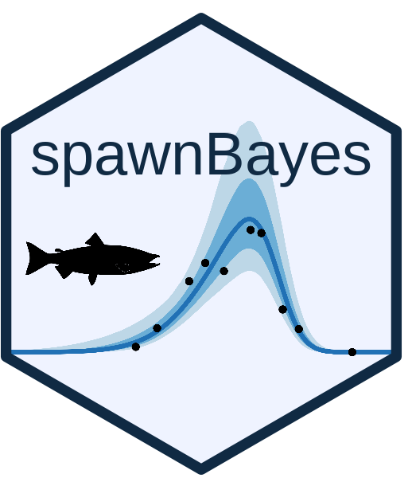

# spawnBayes </a>

`spawnBayes estimates salmon spawner abundance and run timing estimated from repeated
live-count surveys. Unlike traditional area-under-the-curve approaches,
`spawnBayes` estimates abundance, run timing, and their associated
uncertainty while allowing residence time to vary among years.

The package is designed to support salmon stock assessment and escapement
monitoring programs. Users provide survey dates and spawner counts and
obtain estimates of annual abundance, run timing, effective residence
time, and associated uncertainty.

## Installation

```r
# install.packages("remotes")
remotes::install_github("SiRE-P/spawnBayes")
```

## Prerequisites

`spawnBayes` uses `cmdstanr` and requires a local installation of CmdStan.

Install `cmdstanr`:

```r
install.packages(
  "cmdstanr",
  repos = c(
    "https://mc-stan.org/r-packages/",
    getOption("repos")
  )
)
```

Then follow the official CmdStan installation guide:

https://mc-stan.org/docs/cmdstan-guide/installation.html

Verify the installation:

```r
cmdstanr::cmdstan_version()
```

## Data Requirements

Required columns:

| Variable | Description |
|-----------|-------------|
| `date` | Survey date |
| `spawner_counts` | Number of live spawners observed |

Optional columns:

| Variable | Description |
|-----------|-------------|
| `observer_efficiency` | Proportion of fish detected during a survey (0-1) |
| `coverage` | Proportion of spawning habitat surveyed (0-1) |

If `observer_efficiency` or `coverage` are omitted, values of 1 are assumed.

## Quick Example

```r
library(spawnBayes)

data(clemens_sockeye)

fit <- fit_spawner(
  clemens_sockeye,
  assumed_residence = 15.5
)

plot_run_curve(fit)
```

Estimate annual abundance:

```r
abundance(fit)
```

Estimate run timing:

```r
timing(fit)
```

## Worked Example

A complete worked example using Clemens Creek Sockeye salmon data is
included in the package vignette.

After installation, the vignette can be opened with:

```r
vignette(
  "clemens-creek-sockeye",
  package = "spawnBayes"
)

## Data Template

Create a template CSV file in the current working directory:

```r
template_file()
```

This creates:

```text
spawnBayes_template.csv
```

containing the required and optional input columns.

## Citation

If you use `spawnBayes` in a publication, please cite:

Thompson, P. L., Akenhead, S. A., and Louie, C. (2026).
*Estimating spawning salmon abundance from visual surveys: a hierarchical
model of arrival and exit dynamics*.
Canadian Journal of Fisheries and Aquatic Sciences, 83, 1-13.
https://doi.org/10.1139/cjfas-2026-0029