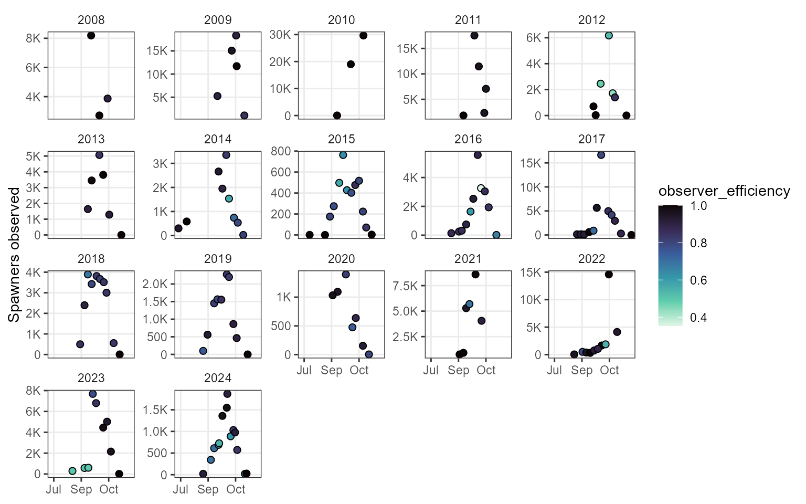
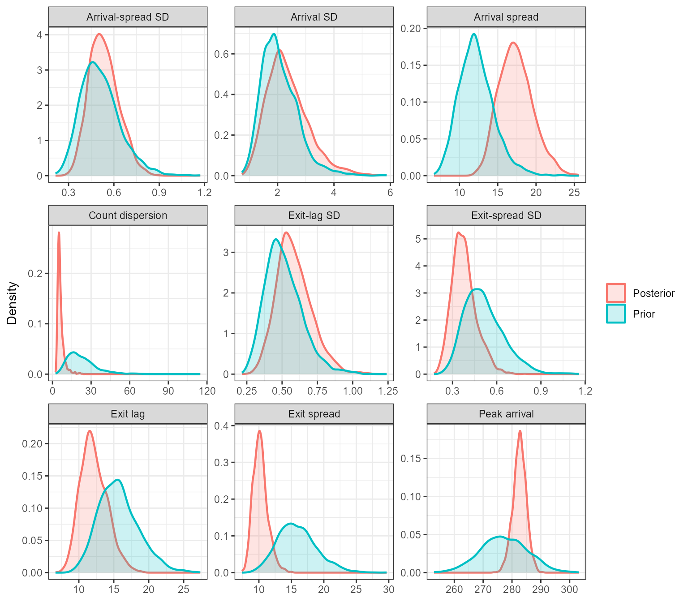
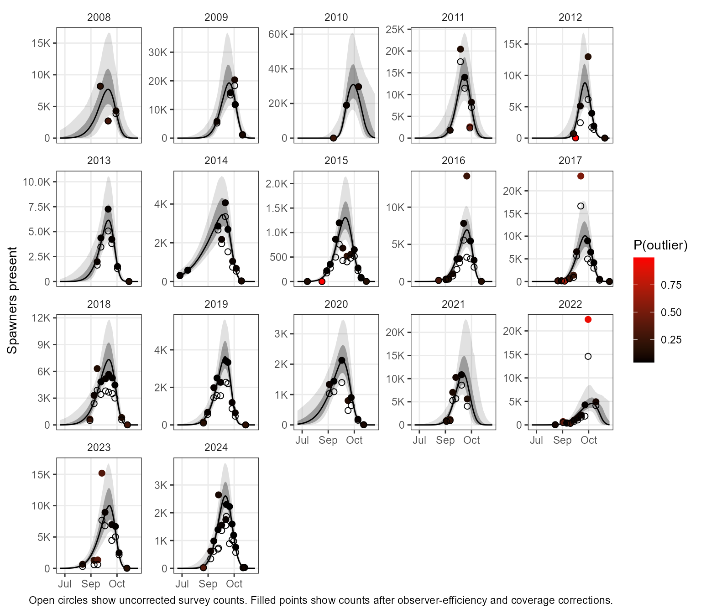
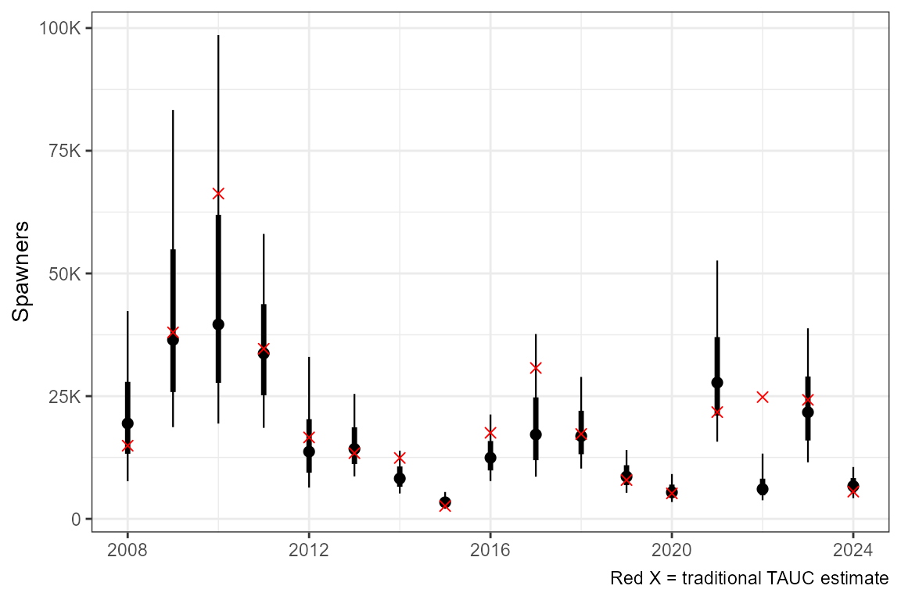
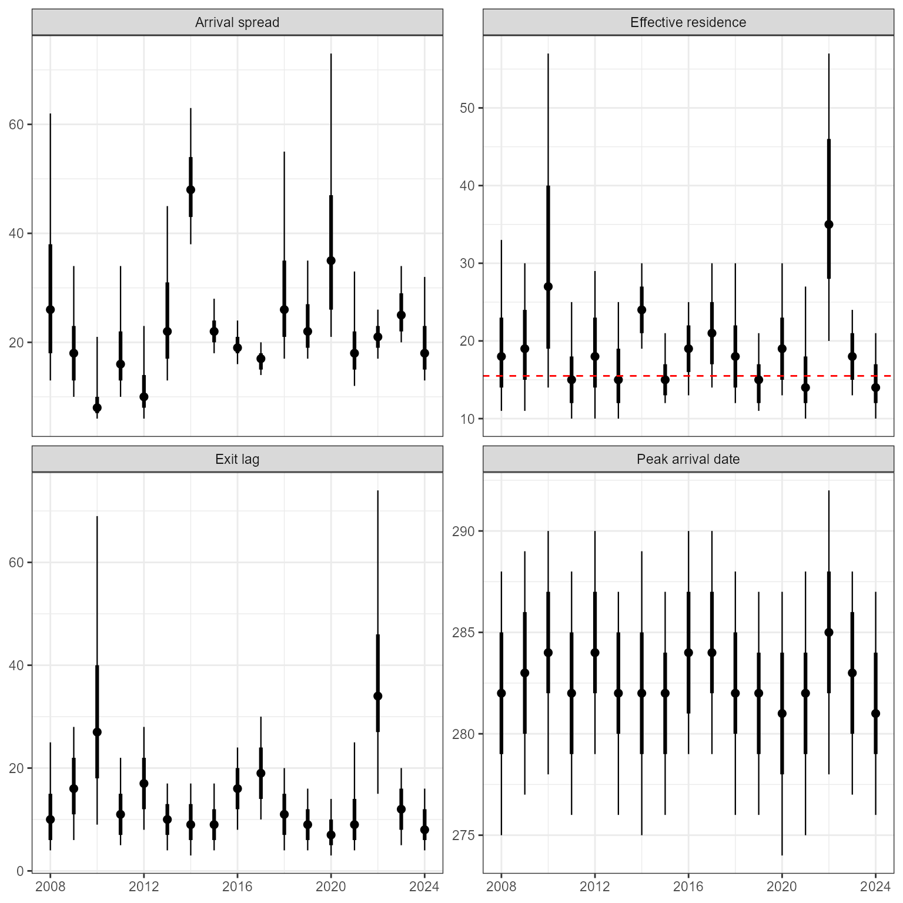

# Getting Started with spawnBayes: A Clemens Creek Sockeye Example

``` r
library(spawnBayes)
library(ggplot2)
library(dplyr)
library(lubridate)

knitr::opts_chunk$set(
  collapse = TRUE,
  comment = "#>",
  warning = FALSE,
  message = FALSE
)
```

## Introduction

spawnBayes estimates salmon spawner abundance and run timing from
repeated live-count surveys. Unlike traditional area-under-the-curve
approaches, spawnBayes estimates abundance, run timing, and their
associated uncertainty while allowing residence time to vary among
years.

The underlying methodology is described in Thompson et al. (2026).

Additional features introduced after Thompson et al. (2026) include
support for survey-error groups, allowing separate
observation-dispersion parameters to be estimated for different survey
types or quality classes, and an optional robust observation model that
reduces the influence of anomalous survey counts.

This vignette demonstrates a complete analysis using sockeye salmon
survey data from Clemens Creek, BC, Canada. These data were provided by
Diana McHugh, South Coast Stock Assessment, Fisheries and Oceans Canada.

## Workflow

A typical spawnBayes analysis consists of:

1.  Preparing survey observations.
2.  Validating the data structure.
3.  Fitting the Bayesian model.
4.  Evaluating diagnostics.
5.  Estimating abundance and run timing.

## Example data

Load in the example dataset and inspect it. The model requires a date
column and a spawner_counts column. Optional observer_efficiency,
coverage, and survey_error_group columns can be supplied. Observation
efficiency and coverage are used to adjust observed counts, while
survey_error_group allows separate observation-dispersion parameters to
be estimated for different survey types or quality classes.

In this case, dates are provided as character strings, and observer
efficiency and coverage have been provided as percentages. These will be
converted into the proper format in the data validation step.

``` r
data(clemens_sockeye)

summary(clemens_sockeye)
#>      date           spawner_counts    observer_efficiency   coverage        
#>  Length:140         Min.   :    0.0   Length:140          Length:140        
#>  Class :character   1st Qu.:  370.8   Class :character    Class :character  
#>  Mode  :character   Median : 1040.0   Mode  :character    Mode  :character  
#>                     Mean   : 2740.3                                         
#>                     3rd Qu.: 3367.8                                         
#>                     Max.   :29651.0
```

## Validate data

The first step is to validate and standardize the input data. This
converts the dates into their proper format and converts observer
efficiency and coverage to proportions if they were provided as
percentages. Validation may generate warnings if missing correction
factors are supplied or if some years show potential evidence of
multiple run peaks.

``` r
clemens_sockeye <- validate_data(clemens_sockeye)

summary(clemens_sockeye)
#>       date            spawner_counts    observer_efficiency    coverage     
#>  Min.   :2008-09-24   Min.   :    0.0   Min.   :0.3538      Min.   :0.5000  
#>  1st Qu.:2014-10-21   1st Qu.:  370.8   1st Qu.:0.7963      1st Qu.:0.8000  
#>  Median :2017-10-28   Median : 1040.0   Median :0.8899      Median :0.9000  
#>  Mean   :2018-01-09   Mean   : 2740.3   Mean   :0.8512      Mean   :0.8772  
#>  3rd Qu.:2021-09-29   3rd Qu.: 3367.8   3rd Qu.:0.9570      3rd Qu.:1.0000  
#>  Max.   :2024-11-15   Max.   :29651.0   Max.   :1.0000      Max.   :1.0000  
#>  survey_error_group
#>  default:140       
#>                    
#>                    
#>                    
#>                    
#> 
```

## Survey observations

Now plot the raw survey counts by date in each year.

``` r
ggplot(clemens_sockeye |> mutate(year = year(date), day = yday(date)),
  aes(x = day, y = spawner_counts, fill = observer_efficiency))+
  geom_point(pch = 21, size = 2) +
  facet_wrap(~year, scales = "free_y")+
  theme_bw() +
    theme(
      strip.background = element_blank(),
      panel.grid.minor = element_blank()
    ) +
    scale_y_continuous(
      labels = scales::label_number(
        scale_cut = scales::cut_short_scale()
      ),
      name = "Spawners observed"
    ) +
    scale_x_continuous(
      labels = function(x)
        format(
          as.Date(x, origin = "2023-12-31"),
          "%b"
        ),
      name = NULL
    )+
  scale_fill_viridis_c(option = "G", direction = -1)
```



## Fit the model

spawnBayes estimates annual run timing and abundance jointly across
years. Information is shared among years through a hierarchical model,
improving estimation in years with sparse survey data.

By default, spawnBayes fits a robust observation model that allows a
small proportion of surveys to arise from a higher-variance observation
process. This reduces the influence of unusual surveys on abundance and
run-timing estimates. The feature can be disabled using outlier_model =
FALSE.

The settings used in this vignette are intended to keep computation time
reasonable. For applied analyses, users should always examine the
diagnostic output and increase the number of iterations when
recommended. Even so, the model may require several minutes to fit.

``` r
fit <- fit_spawner(clemens_sockeye, iter_warmup = 500, iter_sampling = 500, assumed_residence = 15.5, adapt_delta = 0.99, refresh = 0)
#> Running MCMC with 4 parallel chains...
#> Chain 2 finished in 92.5 seconds.
#> Chain 1 finished in 101.2 seconds.
#> Chain 3 finished in 102.0 seconds.
#> Chain 4 finished in 102.3 seconds.
#> 
#> All 4 chains finished successfully.
#> Mean chain execution time: 99.5 seconds.
#> Total execution time: 102.7 seconds.
```

## Model diagnostics

The
[`diagnostics()`](https://sire-p.github.io/spawnBayes/reference/diagnostics.md)
function summarizes several indicators of MCMC sampling performance and
model convergence.

``` r
diagnostics(fit)
#>   converged    quality divergences treedepth_hits max_rhat min_ess_bulk
#> 1      TRUE acceptable           0              0    1.009          318
#>   min_ess_tail      recommendation
#> 1          721 No action required.
```

In this example, all diagnostic checks were acceptable. No divergent
transitions were detected, no maximum tree-depth warnings were
encountered, and the largest Rhat value was close to 1. Effective sample
sizes for both bulk and tail regions of the posterior distribution were
sufficient for reliable inference.

When fitting new datasets, users should pay particular attention to:

- Divergences: should be zero whenever possible.
- Tree depth hits: frequent hits may indicate that model settings should
  be adjusted.
- Rhat: values close to 1 indicate convergence, while values
  substantially greater than 1 suggest poor mixing among chains.
- Effective sample size (ESS): larger values indicate better estimation
  of posterior summaries.

The recommendation column provides a summary of whether additional model
tuning or longer runs are required.

## Prior-posterior comparisons

Prior-posterior comparisons are a useful diagnostic for understanding
how much information the data contribute to parameter estimation. When
using loosely informative priors, posterior distributions are often
expected to be narrower than the priors while remaining largely
consistent with them. Prior-posterior comparisons can help identify
parameters that are strongly informed by the data and assess whether
prior assumptions are reasonable.

``` r
prior_post_plot(fit)
```



## Estimated run

The fitted curves represent the estimated number of spawners present
through time. Shaded regions show the 66 and 95% credible intervals.
Observed survey counts are shown as points. When the outlier model is
enabled, point colour indicates the posterior probability that a survey
belongs to the outlier observation component. The open circles show the
uncorrected survey counts. The filled circles are corrected for observer
efficiency and survey coverage.

``` r
plot_run_curve(fit)
```



## Outlier diagnostics

`spawnBayes` can identify surveys that deviate substantially from the
overall run-timing pattern. These observations are not removed from the
analysis; instead, the model estimates the probability that they arise
from a higher-variance observation process and correspondingly reduces
their influence on parameter estimation.

Surveys with elevated outlier probabilities may reflect counting errors,
unusual survey conditions, inaccuracies in correction factors, or
biological patterns that are not fully captured by the run-timing model.
Elevated outlier probabilities do not necessarily indicate erroneous
data. Rather, they identify observations that are difficult to reconcile
with the fitted observation and run-timing processes.

Users are encouraged to inspect years containing surveys with high
outlier probabilities and assess whether the fitted run-timing model is
appropriate for estimating spawner abundance.

## Abundance estimates

The abundance summary reports posterior median abundance estimates and
credible intervals for each year. When residence time is supplied,
traditional trapezoidal area under the curve (TAUC) abundance estimates
are also reported, together with the percent difference between the
posterior median abundance estimate and the corresponding TAUC estimate.

Two diagnostic indicators are included in the abundance table. The
`multimodal` column identifies years with evidence of multiple major
run-timing peaks, which may violate the model assumption of a single
seasonal peak. The `n_outliers` column reports the number of surveys
within each year having posterior outlier probabilities greater than
0.25. These diagnostics should be interpreted as indicators of potential
model-data conflict rather than measures of data quality.

``` r
abund <- abundance(fit)
knitr::kable(abund)
```

| year | median | lwr_95 | lwr_66 | upr_66 | upr_95 |  TAUC | pct_diff_TAUC | multimodal | n_outliers |
|-----:|-------:|-------:|-------:|-------:|-------:|------:|--------------:|:-----------|-----------:|
| 2008 |  19440 |   7667 |  13253 |  27912 |  42339 | 14911 |          30.4 | FALSE      |          1 |
| 2009 |  36456 |  18679 |  25834 |  54909 |  83292 | 37985 |          -4.0 | FALSE      |          0 |
| 2010 |  39614 |  19414 |  27714 |  61947 |  98563 | 66268 |         -40.2 | FALSE      |          0 |
| 2011 |  33701 |  18543 |  25176 |  43741 |  58053 | 34652 |          -2.7 | FALSE      |          1 |
| 2012 |  13689 |   6374 |   9414 |  20310 |  32988 | 16593 |         -17.5 | FALSE      |          1 |
| 2013 |  14245 |   8658 |  11155 |  18648 |  25445 | 13387 |           6.4 | FALSE      |          0 |
| 2014 |   8220 |   5171 |   6546 |  10670 |  13892 | 12401 |         -33.7 | FALSE      |          0 |
| 2015 |   3366 |   2042 |   2695 |   4225 |   5467 |  2611 |          28.9 | TRUE       |          1 |
| 2016 |  12443 |   7706 |   9864 |  15854 |  21253 | 17529 |         -29.0 | FALSE      |          2 |
| 2017 |  17173 |   8595 |  11951 |  24746 |  37650 | 30735 |         -44.1 | FALSE      |          4 |
| 2018 |  16854 |  10247 |  13166 |  22009 |  28915 | 17290 |          -2.5 | TRUE       |          1 |
| 2019 |   8605 |   5301 |   6863 |  10926 |  14021 |  7904 |           8.9 | TRUE       |          0 |
| 2020 |   5409 |   3426 |   4285 |   6976 |   9124 |  5188 |           4.3 | FALSE      |          0 |
| 2021 |  27755 |  15719 |  21061 |  37033 |  52638 | 21745 |          27.6 | FALSE      |          0 |
| 2022 |   6063 |   3782 |   4799 |   8176 |  13283 | 24805 |         -75.6 | FALSE      |          3 |
| 2023 |  21717 |  11521 |  15966 |  29003 |  38825 | 24246 |         -10.4 | FALSE      |          2 |
| 2024 |   6665 |   4221 |   5330 |   8291 |  10554 |  5543 |          20.2 | FALSE      |          1 |

The abundance plot shows the median (point) as well as the 66 and 95%
posterior credible intervals. The red x shows the estimate based on
trapezoidal area under the curve, with an assumed 15.5 day residence
(survey life).

``` r
plot_abundance(fit)
```

 \# Timing
estimates

Run timing summaries describe the estimated distribution of spawner
arrival dates, residence, and exit lag in each year.

``` r
plot_timing(fit)
```



## Conclusions

spawnBayes provides a framework for estimating salmon spawner abundance
and run timing from repeated live-count surveys while accounting for
uncertainty in both the observation and process components of the model.

## Citation

The methods implemented in `spawnBayes` are described in:

Thompson, P. L., Akenhead, S. A., and Louie, C. (2026). *Estimating
spawning salmon abundance from visual surveys: a hierarchical model of
arrival and exit dynamics*. Canadian Journal of Fisheries and Aquatic
Sciences, 83, 1-13. <https://doi.org/10.1139/cjfas-2026-0029>

Users are encouraged to cite both the package and the accompanying
manuscript when using spawnBayes in scientific publications.
